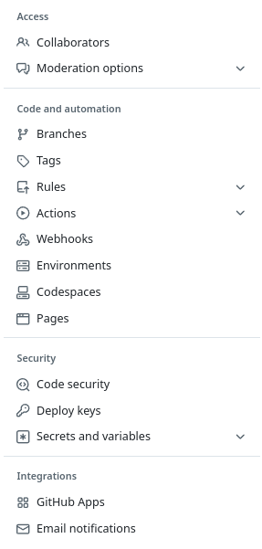
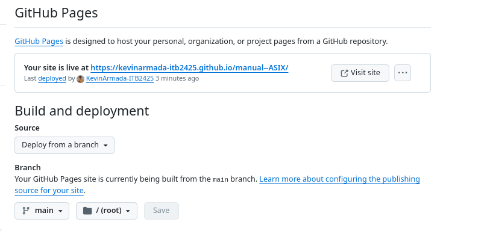

# Manual -- ASIX

## Soporte Técnico

Para más información sobre Soporte Técnico, consulta el archivo [suporttecnic.md](suporttecnic.md).

---
## Análisis de Datos

Consulta el archivo [analisis_de_datos.md](analisis_de_datos.md) para más detalles sobre Análisis de Datos.

---
## Desarrollo

Más información sobre el desarrollo en el archivo [Desenvolupamiento_IA.md](Desenvolupamiento_IA.md).

---
## Gestión de la Seguridad

Para saber más sobre Gestión de la Seguridad, revisa el archivo [gestio_seguretat.md](gestio_seguretat.md).

---
## Redes

Para información sobre redes, consulta el archivo [xarxas.md](xarxas.md).

---
## Publicacion a Github Pages
Para poder hacer la publicación en GitHub Pages, dentro de nuestro repositorio nos vamos a

---

Y en el lado izquierdo nos saldrán varias opciones

---

Entramos en el apartado de **Pages**

---

Una vez dentro de Pages

---

en el apartado de **Branch** seleccionamos la rama **Main** y le damos a save. Después de 1 o 2 minutos aparecerá **GitHub Pages** como que ya se ha publicado la página.
